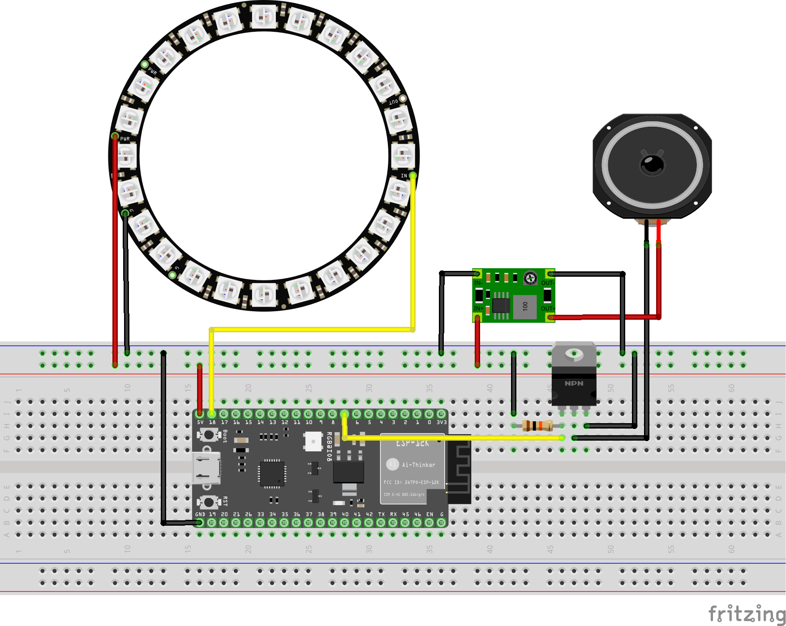

## 3.2 Feedback Device

### 3.2.1 General
This document provides information on the internal workings of the Feedback Device, which passes visual and audio feedback from the Jenkins Framework to the user.

### 3.2.2 Components
* ESP32-S2-saola-1
* 12V Siren 
* Adafruit Neopixel LED Ring 
* DC/DC Converter (5V - 12V)
* Emergency Stop Switch 
* IRFZ44N Power MOSFET
* Resistor (10k Ω)

The datasheets can be found [here](/doc/Datasheets-FBD/).

### 3.2.3 Schematic

### 3.2.4 Setup
The Feedback Device is powered via a 5 V micro-USB cable. A blue pulsing light on the LED ring indicates that it is successfully plugged in and running. Before the device can be used, the SSID and password of the network used must first be changed in the [main.cpp](../../release/ESP32_FeedbackDevice/src/main.cpp) accordingly.

### 3.2.5 Functionality
The status of the build will be sent via a curl statement to the ESP32 (see also: [Http-Request](../src/ESP32-S2/../../../src/ESP32-S2/ESP32_Http_Request/Readme.md)). 
  
When the Feedback Device receives a status of 1, it means that the build was succesful. In this case, the LED ring lights up cyclically in a green light.
A status of 2 means that an error occurred during the process. The LED ring will flash in a red light and the siren emits a continuous tone. The emergency stop switch serves as a mute button, since it disconnects the siren from the rest of the circuit.