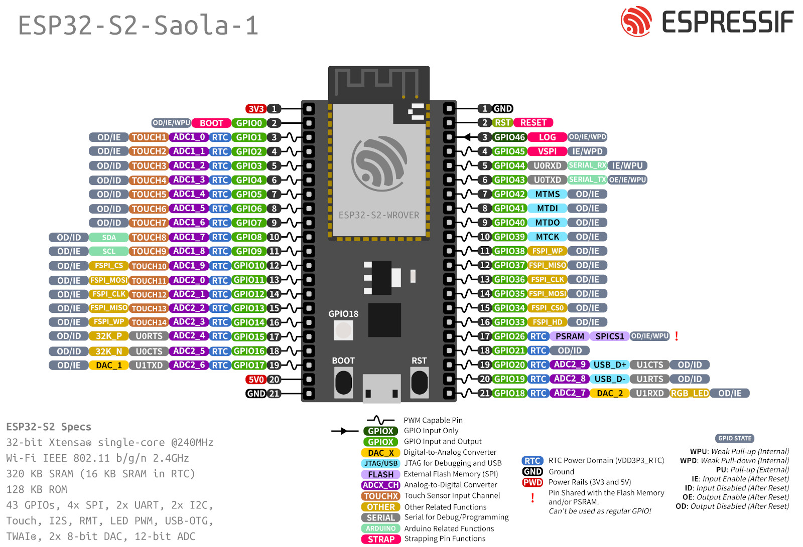

### 3.3 Hardware Double
#### 3.3.1 General
The Hardware Double is the heart of this project. It is implemented with a ESP32-S2-Saola-1 and makes it possible to test the software of the DUT without the need of the real setup. The code on the DUT doen't need to be changed and can be used after successful testing the code, on the real hardware. 
Sensors are emulated with the self written Sensor Library and are sent to the inputs of the DUT. Than the outputs of the DUT are immediately checked by the Hardware Double. After finishing all test, Jenkins provides Feedback of the test results.

#### 3.3.2 Process more in Detail

The key is to let Jenkins automatically build and deploy the project that should be tested. As the ESP is emulating the sensor that should be used in the real setup, it is needed to implement the functionalities to provide the DUT the correct input data. The ESP has a very good hardware reference to provide these signals. 

Make sure to give the DUT as well as the Hardware Double, the correct logic level. For converting logic levels, a PCB is provided, which will be explained later.
In the following examples it will be explained how the sensors were emulated.

The next step is to write the proper unit tests for the DUT. Note that the void loop() function will not be used as the Hardware Double shall only run the test once. So the whole implementation will be written in the void setup() function. In this project [Unit Tests](../../unity/) are used for testing the software of the DUT. This brings also the huge advantage of the Hardware Double, because it is very easy possible to test the whole range of a sensor automatically without the use of real hardware setup and the Unity Framework provides Jenkins the needed Log and Feedback of the test.

#### 3.3.3 PCB for Logic Level Shift
The altium project of the PCB for the connection between the Hardware Double and the DUT is in [this](../../pcb/) folder.

#### 3.3.4 Testing DUT
This project contains the implementation of the test cases for the Hardware Double. A simple Car Model shall be tested and the sensors for that will be emulated of the Hardware Double. It contains a Joystick that controls the Fan-motor and a servo. By pushing the joystick up/down the car moves forward/backwards and with pushing the stick left/right the car steers in this direction. There is also a park assistance included, that turns on a green, yellow and red LED depending on the distance to the obstacle in front of the ultrasonic sensor.

The joystick is emulated by applying analog voltages on the input of the DUT, with the DACs of the ESP32. The ultrasonic sensor is emulated by applying a digital HIGH signal for certain time depending on the distance.

Note that the ESP32 has not the same logic level as the Arduino UNO. Use the PCB for connecting the two devices.

#### 3.3.4 Code for the DUT
By clicking on [this](../UNO_DUT_Car/) link you get to the project that will be automatically uploaded to DUT.

#### 3.3.5 Library
On [this](lib/doc/html/index.html) site you can find all functions that were implemented for the library and its instructions.

## List of references
[Unit-Testing](../../unity/)